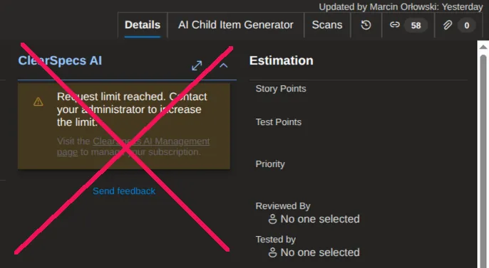
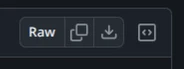

```ascii
█  █  ▀     █          ▄▀▀▄
█▀▀█ ▀█  ▄▀▀█ ▄▀▀▄     █  █ ▀▀▀█ █  █ █▄▀ ▄▀▀▄
█  █  █  █  █ █▀▀      █▀▀█  ▄▀  █  █ █   █▀▀
█  █ ▄█▄ ▀▄▄█ ▀▄▄▀     █  █ █▄▄▄ ▀▄▄▀ █   ▀▄▄▀

              ▄▀▀▄ ▀█                ▄▀▀▄                         ▄▀▀▄ ▀█▀
              █     █  ▄▀▀▄ ▄▀▀▄ █▄▀ ▀▄▄  █▀▀▄ ▄▀▀▄ ▄▀▀▄ ▄▀▀▄     █  █  █
              █     █  █▀▀   ▄▄█ █      █ █  █ █▀▀  █     ▀▄      █▀▀█  █
              ▀▄▄▀ ▄█▄ ▀▄▄▀ ▀▄▄▀ █   ▀▄▄▀ █▄▄▀ ▀▄▄▀ ▀▄▄▀ ▀▄▄▀     █  █ ▄█▄
                                          █
```

# Azure DevOps: Hide ClearSpecs AI panel

A [Tampermonkey](https://www.tampermonkey.net/) userscript that removes the **ClearSpecs AI**
panel from Azure DevOps work-item forms and widens the description column to fill the freed space.



Azure DevOps organizations that install the third-party **ClearSpecs AI** extension get a sizeable
panel rendered on every work-item page - even for users who don't use it, have no access, or have
hit the extension's request limit. The panel cannot be dismissed from the UI and steals horizontal
space that would otherwise belong to the ticket description, acceptance criteria, and other fields.

## Installation

Assuming Tampermonkey extension is installed **and** enabled.

1. Open [script page in your browser](https://github.com/MarcinOrlowski/hide-azure-clearspecs-ai/blob/master/hide-azure-clearspecs-ai.user.js).
1. Click `Raw` button - this shall redirect you to Tampermonkey editor, with script already loaded.
1. Click `Install` button.
1. Reload any open Azure DevOps work-item page and enjoy junk-less rendition.



## License

- Written and copyrighted ©2026 by Marcin Orlowski \<mail (#) marcinorlowski (.) com>
- This is open-sourced software licensed under the [MIT license](http://opensource.org/licenses/MIT)
